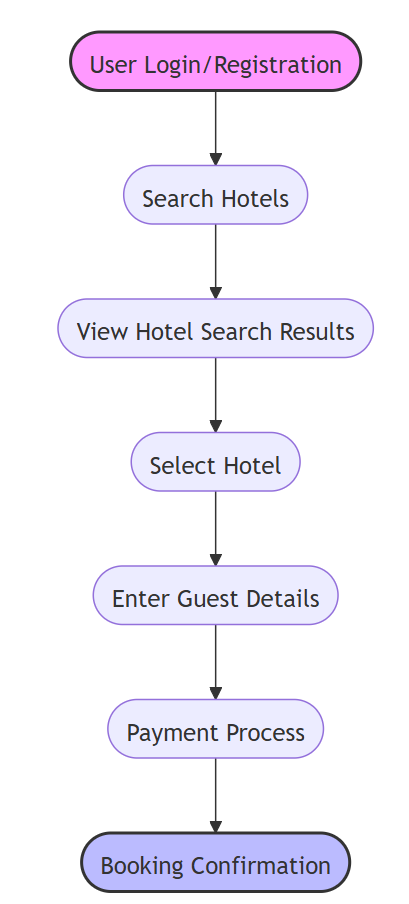
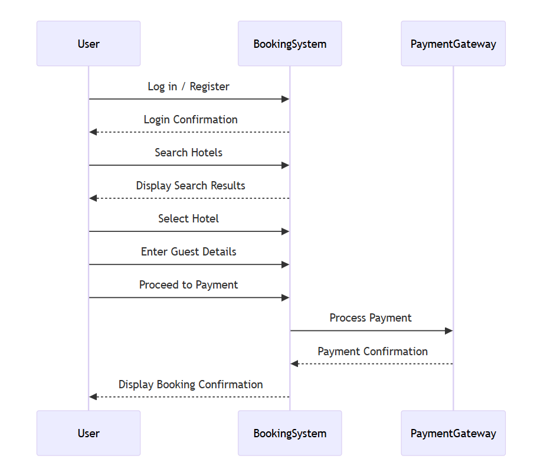
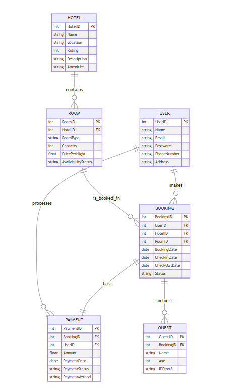
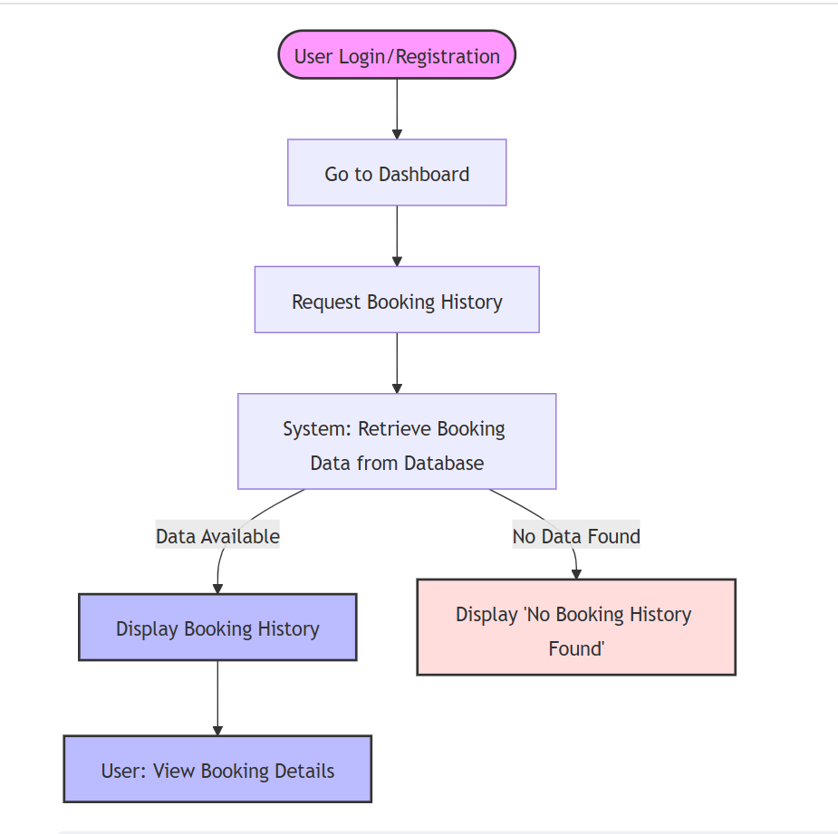
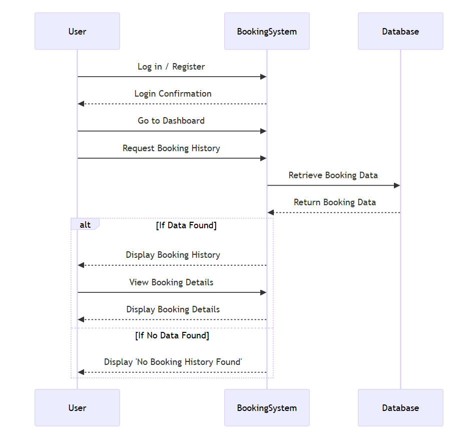

# Hotel Booking System - hotel Use Case Diagrams

This repository contains use case diagrams for the **Hotel Booking System**, illustrating various functionalities and user interactions. The diagrams are designed to provide a clear understanding of the different user flows, system functions, and the interactions between the actors (users, booking system, and payment gateway).
- **Registered User Book Hotel use case**
- **Retrieve Booking history use case**

## Overview

The **Booking System** cases enables users to:
- Search and book hotel rooms
- Manage guest details for each booking
- Process payments securely
- View and manage booking history

## Use Case Diagrams

### 1. **Book Hotel Room**
- **Flowchart diagram
  

- **Sequence diagram**
  

- pseudocode
### Pseudocode
    BEGIN HotelBookingProcess

     // User Login or Registration
    IF User is not logged in THEN
        Prompt User to log in or register
        IF Login or Registration successful THEN
            Display "Login Successful"
        ELSE
            Display "Login Failed"
            RETURN
        END IF
    END IF

    // Search for Hotels
    Display "Enter search criteria for hotels"
    User enters location, dates, and other preferences
    hotelsList = SearchHotels(location, dates, preferences)
    Display hotelsList

    // Select Hotel
    Display "Select a hotel from the list"
    User selects a hotel
    selectedHotel = hotelsList[selectedHotelID]

    // Enter Guest Details
    Display "Enter guest details"
    guestDetails = GetGuestDetails()
    
    //  Payment Process
    Display "Proceed to Payment"
    IF User confirms payment THEN
        paymentStatus = ProcessPayment(guestDetails, selectedHotel)

        IF paymentStatus == "Success" THEN
            // Booking Confirmation
            bookingConfirmation = ConfirmBooking(guestDetails, selectedHotel)
            Display "Booking Confirmation", bookingConfirmation
        ELSE
            Display "Payment Failed"
        END IF
    ELSE
        Display "Payment Canceled"
    END IF

    END HotelBookingProcess

- **ERD diagram**
  

### 2. **Retrieve Booking history**
- **Flowchart diagram**
  

- **Sequence diagram**
  

- pseudocode
### Pseudocode
    BEGIN RetrieveBookingHistory

    // User Login or Registration
    IF User is not logged in THEN
        Prompt User to log in or register
        IF Login or Registration successful THEN
            Display "Login Successful"
        ELSE
            Display "Login Failed"
            RETURN
        END IF
    END IF

    //  Navigate to Dashboard
    Display "Dashboard"

    // Step 3: Request Booking History
    Display "Request Booking History Option"
    IF User selects "Request Booking History" THEN
        //  Retrieve Booking Data from Database
        bookingData = FetchBookingData(UserID)

        // Step 5: Check if Booking Data is Available
        IF bookingData is NOT empty THEN
            // Display Booking History
            Display bookingData

            //  Option to View Booking Details
            Display "Select a Booking to View Details"
            IF User selects a booking THEN
                selectedBooking = bookingData[SelectedBookingID]
                Display selectedBooking details
            END IF

        ELSE
            // If No Booking History Found
            Display "No Booking History Found"
        END IF
    END IF

    END RetrieveBookingHistory

